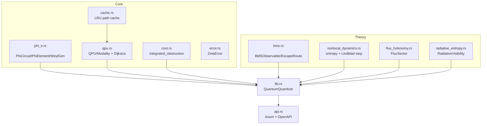

# zeta-quantum

[](https://github.com/zetareticula/zeta-quantum/actions/workflows/ci.yml)
[](https://crates.io/crates/zeta-quantum)
[](https://docs.rs/zeta-quantum)
[](LICENSE)
[](https://www.rust-lang.org)
[](https://doc.rust-lang.org/edition-guide/rust-2021/index.html)
[](https://github.com/zetareticula/zeta-quantum/commits/main)

Quantum extension of Zeta Reticula.  
Real-time, calibration-aware compilation with Affine Weyl IR + salience-driven fidelity quantization.

`zeta-quantum` is a Rust library + HTTP service that:

- Compiles circuits into **Phi-IR** (Affine Weyl group words)
- Estimates **integrated obstruction** (`S_X`) using a modality-aware QPU model
- Projects obstruction into **BMS-observable** channels (with optional escape routes)
- Computes toy implementations of:
  - **Theorem 1**: nonlocal Lindblad evolution + subsystem reduction
  - **Theorem 2**: flux/holonomy sector + entanglement witness
  - **Radiative visibility**: when entropy could become geometric (new physics options)

## Status

| | |
|---|---|
| Latest release | `v0.6.1` — [crates.io](https://crates.io/crates/zeta-quantum) |
| Library crate | `zeta-quantum` |
| Server binary | `zeta-quantum-server` (Axum) |
| Tests | 13 unit + integration + doc-tests |

## Installation

```bash
cargo add zeta-quantum
```

## Quickstart (library)

```rust
use std::collections::HashMap;
use zeta_quantum::{EscapeRoute, Modality, PhiCircuit, PhiElement, QuantumQuantizer};

// Build calibration map: "<qA>-<qB>" -> CNOT error rate
let mut calibration = HashMap::new();
calibration.insert("0-1".to_string(), 0.005);
calibration.insert("1-2".to_string(), 0.004);

let mut q = QuantumQuantizer::new(Modality::Superconducting, &calibration, "demo".into());

// Build a circuit using helper constructors
let mut circ = PhiCircuit::default();
circ.elements.push(PhiElement::h(0));    // Hadamard on q0
circ.elements.push(PhiElement::cnot(0, 2)); // CNOT q0 → q2

// Or use single-gate circuit constructors
let bell = {
    let mut c = PhiCircuit::hadamard(0);
    c.elements.push(PhiElement::cnot(0, 1));
    c
};

let (_optimized, integrated_obstruction, bms) = q.quantize_with_bms(&circ, EscapeRoute::None)?;
println!("S_X={integrated_obstruction:.4}, decoded={:?}", bms.decoded_sx);
# Ok::<(), anyhow::Error>(())
```

## Architecture

### Data flow

```mermaid
flowchart LR
  A[Circuit JSON / PhiCircuit] --> B[Phi-IR
  (Affine Weyl words)]
  B --> C[QPU model
  (modality + calibration graph)]
  C --> D[Cost / integrated obstruction
  S_X]
  D --> E[BMS projection
  (observable + escape route)]
  D --> F[Theorem 1
  nonlocal dynamics]
  D --> G[Theorem 2
  flux/holonomy]
  E --> H[Radiative visibility]
```

### Module map



## Run the API server

```bash
cargo run --bin zeta-quantum-server
```

The service listens on `http://0.0.0.0:8080`.

### OpenAPI

- `GET /openapi.json` (advertised on startup; may be wired via your router configuration)

## API

- **POST `/optimize`**

Example payload:

```json
{
  "circuit": [
    {"type": "H", "targets": [0]},
    {"type": "CNOT", "targets": [0, 1]}
  ],
  "modality": "superconducting",
  "calibration": {"0-1": 0.013},
  "bms_route": "none"
}
```

### Notes

- `modality`:
  - `superconducting`
  - `iontrap`
  - `neutralatom`
- `calibration` keys use the format `"<qA>-<qB>" -> error_rate`.
- `bms_route`:
  - `none`
  - `scalar`
  - `holographic`

## Configuration

- `cargo add zeta-quantum` to add the library to your project
- `cargo run --bin zeta-quantum-server` to run the API server

## Development workflow

```bash
# Run all tests (13 unit + integration + doc-tests)
cargo test

# Lint
cargo clippy --all-targets --all-features -- -D warnings

# Format
cargo fmt

# Build optimised server binary
cargo build --release --bin zeta-quantum-server

# Run server
./target/release/zeta-quantum-server
```

### Test coverage

| Suite | Count |
|---|---|
| Unit (`src/`) | 9 |
| Integration (`tests/`) | 4 |
| Doc-tests | 2 |
| **Total** | **15** |

## Performance

- `QPU::find_optimal_path` is Dijkstra-based.
- A global **LRU cache** memoizes shortest paths across requests to speed repeated routing.

## Numerical safety (current model)

- `von_neumann_entropy` uses eigenvalues of the symmetrized density matrix and clamps small negative eigenvalues.
- Flux/holonomy computations apply an epsilon threshold to suppress floating-point noise.

## Release / deploy

For local deployment, build the server binary:

```bash
cargo build --release --bin zeta-quantum-server
```

Then run `./target/release/zeta-quantum-server`.

## Contributing

1. Fork the repo and create a branch.
2. Run `cargo fmt` and `cargo clippy` before committing.
3. Add or update tests for any behavioural changes.
4. Open a pull request against `main`.

All contributions are subject to the [MIT License](LICENSE).

## Changelog

### v0.6.1
- Added MIT license headers (Zeta Reticula Inc) to all Rust + Julia source files.
- Added `cost` module unit tests and doc comments.
- Fixed compile errors from accidental `pyo3` bindings in `error.rs` and `cost.rs`.
- Fixed duplicate `Default` impl and stray inner doc comments in `phi_ir.rs`.
- Cleaned unused imports and warnings across `flux_holonomy.rs`, `nonlocal_dynamics.rs`.

### v0.6.0
- Published to crates.io.
- Added `cache.rs` (global LRU path cache), `cost.rs`, `error.rs`.
- Numerically stable `von_neumann_entropy` via eigenvalue decomposition.
- Axum API server with OpenAPI (`utoipa`), compression, timeout middleware.
- GitHub Actions CI workflow (`fmt` + `clippy -D warnings` + `test`).
- README badges (CI, crates.io, docs.rs, license, MSRV, edition, last commit).

## License

Copyright (c) 2026 **Zeta Reticula Inc**

This project is licensed under the [MIT License](LICENSE).